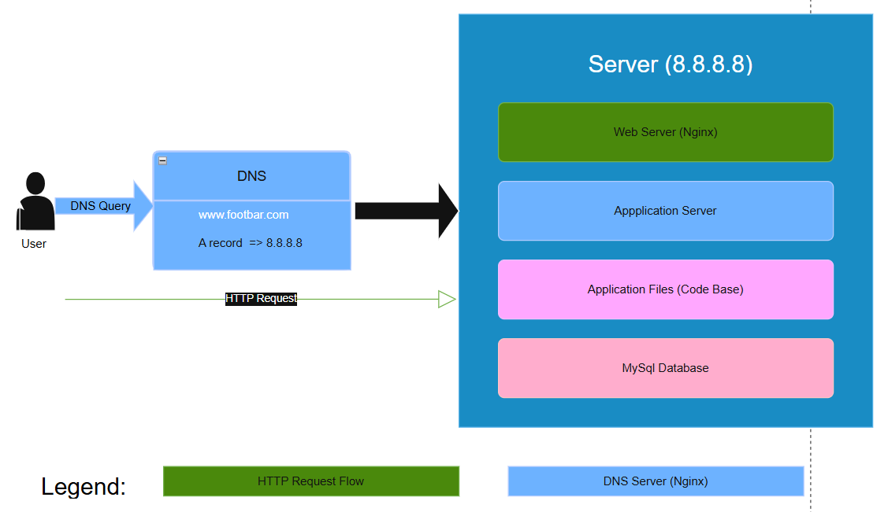

# Simple Web Stack

## Infrastructure Design

https://imgur.com/a/v6KStrM

## Description of Infrastructure

### Components:
1. 1 Server (8.8.8.8)
2. 1 Web Server (Nginx)
3. 1 Application Server
4. 1 Application Files (Code Base)
5. 1 Database (MySQL)
6. Domain name foobar.com with www record

### Component Explanations:

#### Server
- Physical or virtual machine running Linux
- Hosts all components of the web infrastructure
- Single point where all services are running

#### Domain Name (www.foobar.com)
- Provides human-readable address
- www record is an A record pointing to IP 8.8.8.8
- Translates domain name to IP address via DNS resolution

#### Web Server (Nginx)
- Handles HTTP requests
- Serves static content
- Manages SSL/TLS termination
- Routes requests to application server

#### Application Server
- Executes application logic
- Processes dynamic content
- Interacts with database
- Handles business logic

#### Database (MySQL)
- Stores application data
- Manages user information
- Handles data persistence
- Provides data retrieval and storage

#### Communication Flow
- User enters www.foobar.com in browser
- DNS resolution occurs
- HTTP/HTTPS request sent to server IP
- Nginx receives and processes request
- Application server generates dynamic content
- Database provides necessary data
- Response sent back to user

### Infrastructure Issues:

1. SPOF (Single Point of Failure):
   - Single server hosts all components
   - No redundancy
   - Hardware failure = complete outage

2. Maintenance Downtime:
   - Updates require server restart
   - No redundancy during maintenance
   - Service interruption during deployments

3. Scalability Limitations:
   - Cannot handle high traffic
   - No load distribution
   - Resource constraints on single server