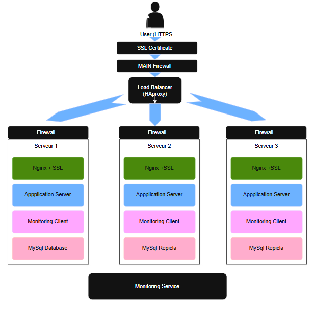

# Secured and Monitored Web Infrastructure

## Description
This is a secured and monitored three-server web infrastructure for www.foobar.com with enhanced security, encrypted traffic, and monitoring.

https://imgur.com/OdjOKnm

## Infrastructure Specifics

### Additional Elements:

1. **3 Firewalls**:
   - Purpose: To protect each server by filtering network traffic
   - Implementation: Between user access points and servers
   - Function: Creates security boundary around infrastructure

2. **1 SSL Certificate**:
   - Purpose: Serves www.foobar.com over HTTPS
   - Implementation: SSL termination at web server level
   - Benefit: Encrypts traffic between users and web servers

3. **3 Monitoring Clients**:
   - Purpose: Data collection for monitoring service
   - Implementation: One on each server
   - Service: Sumo Logic monitoring solution

### Security Measures:
- Firewalls prevent unauthorized access
- HTTPS encryption protects data in transit
- Regular security updates and patches
- Access control and authentication mechanisms

### Monitoring Setup:
- Monitoring clients collect:
  * Server performance metrics
  * Application health checks
  * Network traffic patterns
  * Security events
  * Response time metrics

### QPS Monitoring:
To monitor web server QPS (Queries Per Second):
1. Configure monitoring clients to track incoming requests
2. Set up specific metrics for HTTP/HTTPS requests
3. Create dashboard for real-time QPS visualization
4. Implement alerting for abnormal QPS patterns

## Issues With This Infrastructure

### SSL Termination at Load Balancer Level:
- Issue: Decrypted traffic between load balancer and web servers
- Risk: Internal network traffic exposed
- Impact: Potential security vulnerability

### Single MySQL Write Point:
- Issue: Only one MySQL server accepts writes
- Risk: Single point of failure for write operations
- Impact: Potential data loss or service interruption

### Identical Server Components:
- Issue: All servers have same components
- Risk: Uniform resource consumption
- Impact: Potential resource allocation inefficiencies