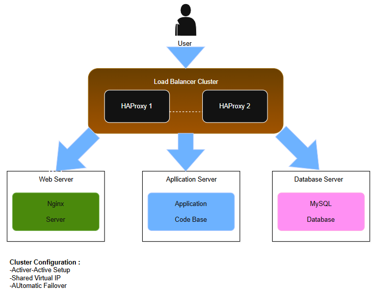

# Scale Up Infrastructure

## Description
This infrastructure extends our previous setup by splitting components across dedicated servers and implementing clustered load balancing for improved scalability.

https://imgur.com/0VLl5f7

## Infrastructure Specifics

### Added Elements:

1. **Additional Server (Total: 4 servers)**:
   - 1 Server for Load Balancer (HAproxy) cluster
   - 1 Server dedicated to Web Server
   - 1 Server dedicated to Application Server
   - 1 Server dedicated to Database

2. **Load-Balancer Cluster**:
   - HAproxy configured in cluster mode
   - Active-Active setup for high availability
   - Shared virtual IP address
   - Automatic failover capability

3. **Component Distribution**:
   - Each component runs on its own server
   - Reduces resource contention
   - Allows for specialized optimization
   - Independent scaling capability

### Why Additional Elements?

1. **Separated Load Balancer**:
   - Dedicated resources for traffic distribution
   - Better performance monitoring
   - Independent scaling of load balancing capacity

2. **Component Separation**:
   - Optimized resource allocation
   - Independent scaling of components
   - Improved security isolation
   - Easier maintenance and updates

3. **Clustered Configuration**:
   - High availability
   - No single point of failure in load balancing
   - Seamless maintenance capability